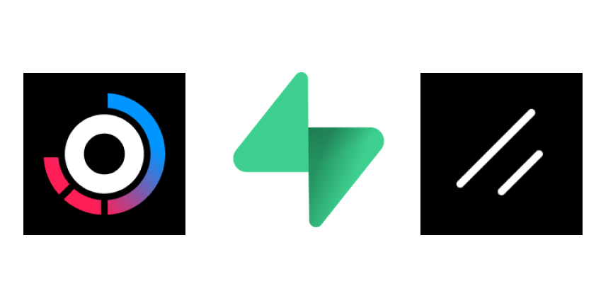
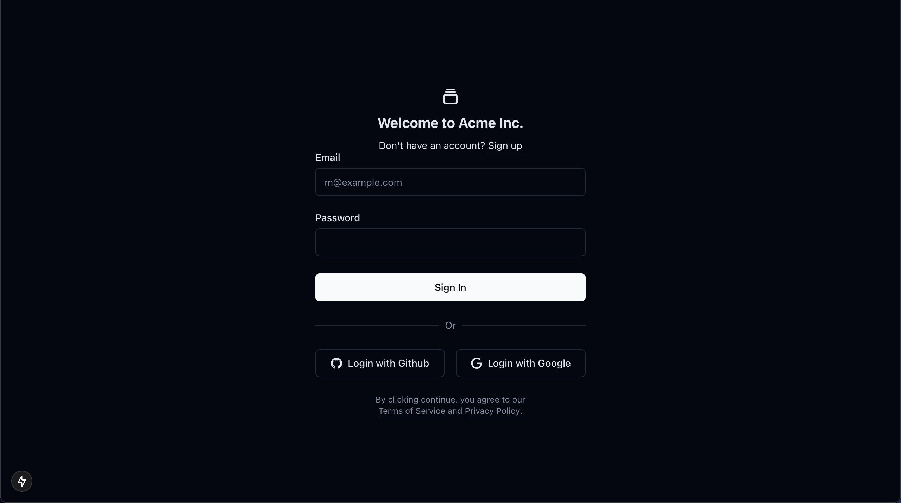

<!-- PROJECT LOGO -->
<br />
<div align="center">
  

  <h3 align="center">Supabase Auth + Turbo + Shadcn</h3>

</div>

<br>

<!-- ABOUT THE PROJECT -->
## About

[](https://github.com/Telmiyo/supabase-auth-turborepo-boilerplate)

This project is a monorepo template designed for a dashboard app auth, using Turbo, Next.js, Supabase and Shadcn/ui.

<!-- GETTING STARTED -->
## Prerequisites


- **The template uses "Email", "GitHub", and "Google" providers for authorization, which need to be enabled in your [Supabase organization.](https://supabase.com/dashboard/projects)**

- **Node.js v20.9.0** / **Corepack Yarn 1.22.22** [https://yarnpkg.com/corepack]()


- [nvm](https://github.com/nvm-sh/nvm/blob/master/README.md)


> [!CAUTION]
> Use Yarn instead of npm. Yarn is included with Node.js, so just run corepack enable to activate it if it’s not already enabled. 
### Installation

1. Clone the repository
  ```bash Terminal
  # HTTPS
  git clone https://github.com/Telmiyo/supabase-auth-turborepo-boilerplate.git

  # SSH(recommended)
  git clone git@github.com:Telmiyo/supabase-auth-turborepo-boilerplate.git
  ```

2. Position youself at the root

```bash Terminal
cd supabase-turborepo-boilerplate/
```

3. Copy the `.env.example` and configure `.env` files.

  > [!IMPORTANT]
  > Replace NEXT_PUBLIC_SUPABASE_URL and NEXT_PUBLIC_SUPABASE_ANON_KEY with your Supabase keys from Project Settings → API in the Supabase dashboard.

```bash Terminal
cp apps/dashboard/.env.example apps/dashboard/.env
```

4. Install Dependencies using Yarn

```bash Terminal
yarn install
```

5. Build the project

```bash Terminal
yarn build
```

6. Run the project  🚀

```bash Terminal
yarn dev
```
